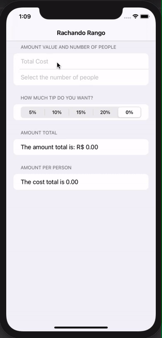

<h1 align="left">
    Rachando Rango
</h1>

<h4 align="left">
  Application that helps to split the restaurant bill.
</h4>

<p align="left">

  
  <a href="https://www.codacy.com/manual/ewersoncastelo/Rachando_Rango?utm_source=github.com&amp;utm_medium=referral&amp;utm_content=ewersoncastelo/Rachando_Rango&amp;utm_campaign=Badge_Grade"></a>
<a href="https://github.com/ewersoncastelo/Rachando_Rango/issues">
    
  </a>
    
  <a href="https://github.com/ewersoncastelo/Rachando_Rango/commits/master">
    
  </a>
</p>

## Preview



## Features

-   SwiftUI
-   Form
-   Section
-   TextField
-   Picker
-   ForEach
-   Text
-   NavigationView

## How To Use

To clone and run this application, you'll need [Git](https://git-scm.com), and last version XCODE IDE 10 higher installed on your computer. From your command line:

```bash
# Clone this repository
$ git clone https://github.com/ewersoncastelo/Rachando_Rango

# Go into the repository
$ cd Rachando_Rango

# Install dependencies
$ pod install

# Run the app in the simulator
$ open -a xcode
```

## :memo: License
This project is under the MIT license. See the [LICENSE](https://github.com/ewersoncastelo/Rachando_Rango/blob/master/LICENSE) for more information.

---

[vc]: https://developer.apple.com/documentation/xcode_release_notes/xcode_11_release_notes
